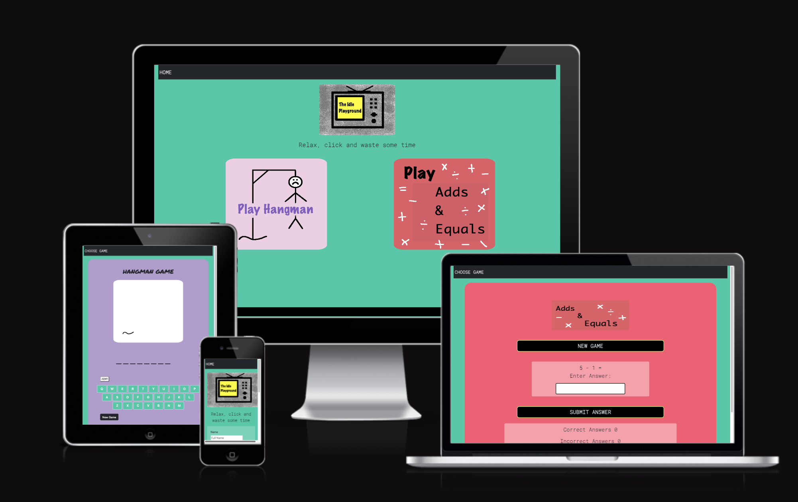

# The Idle Playground
[View live project Here](https://janebmckenna.github.io/Milestone-Project2/index.html)
***

The idle playground is a simple retro style browser based game website that allows people to spend a few minutes playing simple games to pass the time and keep their minds engaged. 

- [The Idle Playground](#the-idle-playground)
- [User Experience UX](#user-experience-ux)
  - [UX-strategy](#ux-strategy)
  - [UX-scope](#ux-scope)
  - [UX-structure](#ux-structure)
  - [UX-skeleton](#ux-skeleton)
  - [UX-surface](#ux-surface)
- [Technologies-used](#technologies-used)
- [Testing](#testing)
- [Deployment](#deployment)
- [Credits](#credits)

# User Experience UX

## UX-strategy

The goal is to provide a simple website that allows users to pass the time playing simple browser based games. 

**Developer Goals**

The website provides a means to develop coding and programming skills and potential future monitiosation through advertising. The MVP of this project is simple but the site can be developed to include additional games and to include more complex java script to improve the first game Hangman. 

**User Goals**

- Entertainment.
- Relaxation.
- Challenge.
- Pass the time.
- Play for free.

**User Stories**

_As a FIRST TIME user of the site I want to be able to:_
- Intuitively and easily navigate the site
- Intuitively be able to play the game/games
- Find help or instruction if nessicary
- Play the games on a mobile device without the need for any additional downloads. 

_As a RETURNING user of the site I want to be able to:_
- Easily navifate to my favourite game
- Send feedback and ideas for more games to the website owner

## UX-scope
The site will be written using html and css with javascript controlling the game and site functionality. 

**Existing Features**

**Home/Choose Game Page**

Due to the simple layout of the site I didnt feel the need to include a classic Nav bar with navigation to the two games included on the site. I felt that the 'Choose Game' link to the home page was in keeping with the retro feel of the site. 

**The Idle Playground Logo**

This is a retro logo for the idle playground with a simple tag line to indicate the relaxed nature of the games and subtly conveys the message that the games are just a bit of fun to play while you're passing some time. 

**Game Play Buttons**

Inital MPV will be two games Play Hangman and Play Adds and Equals

**Contact Us**

Simple link which opens in a new window to allow users to send feedback. The simple form uses and API email.js to forward the details to me. 

**Hangman Game**

Simple game written using Javascript, HTML and CSS. The keyboard is button based on the screen which allows the keys to visually disable for the user when they've already been played. The user has the option to trigger the Hint button to display a hint and resets to hidden when a new game is started. 

**Adds & Equals Game**

Simple maths game written using, Javascript, HTML and CSS. The game randomly chooses an addition, subtraction, multiplication or division game with two random numbers. The game tallys the number of correct or incorrect responses. 

**Win/Loss Screen**

Once the game is won or lost the win/loss screen appears with confirmation and the correct answer as appropriate. Within the Adds & Equals game I have set the screen to automatically timeout after 2 seconds and start a new game, this is due to the fact that I've set the input as the focus when the DOM loads and I dont want the user to have to click out of the input box. 

**Hangman game - Generating words**
  1. Create a list of words and hints in an array.
  2. Create approx 5 category buttons, each button would call on its own array of words. The hint is implied by the category choosen but a hint could also be included. 
  3. Find an API to automatically generate words.

Pro to the first option is the simplicity of the idea, easy to excectute and impliment. 
Con is that it is limiting for the player as extended play may make them famililar with 
the range of words. Second option similarly is simple to excecute but potentially also limiting for the player. The second option does has the added benefit for the player to allow them to choose the category of word they wish to play with. The third option extends the potential logevity of the game as there would be a much wider number of possible words. To this point I havent been able to find one that could also provide a hint rather than a definition to the player. Without a hint the game maybe too difficult but with a definition too easy. 

**Future Improvements**

## UX-structure

**Navigation**

Due to the nature of the game site, I have deemed tradional navigation of the site unneccisary instead using the navigation bar to house 'Choose Game'. 

Buttons are used to naviagte game states allowing users to start a new game at will. 

**Game Pages**

**Footer**

I've chosen to use the tradional footer space to house a contact us link which opens in a new tab and allows users to provide feedback and ideas to me. 

**Win/Loss Screens**

## UX-skeleton

**Design Choices**

I have chosen a retro style for the site. From the simple retro logo, the basic hangman graphics and the overall color choices, fonts and style of the site. 

**Wireframes**

[View Wireframes](wireframes.md)

## UX-surface

# Technologies-used

- **Languages:** HTML, CSS, JavaScript
- **Libaries:** jQuery, bootstrap
- **Code Anywhere:** used as a cloud code editor.
- **GitHub:** used as a cloud based code repository.
- **GitHub Pages** was used to deploy the site.

# Testing 
[View Testing Documentation](testing.md)

# Deployment
The Website has been deployed using GitHub Pages [Here](https://janebmckenna.github.io/Milestone-Project2/index.html) using the method below:

- I logged into my GitHub account.
- I opened my repository for this site.
- Within the repository I selected 'Settings'
- I navigated to 'Pages' within 'Settings'
- I selected 'Deploy from a branch' from the source menu then the 'Main' branch along with the 'root' folder.
- I then saved the options to deploy the site.

To deploy this website using source files:

- Go to the repository [Here](https://github.com/janebmckenna/Milestone-Project2)
- Clone the repository onto your local device by
  - Click 'Code'
  - Chose 'Download Zip'
- Open the Zip file on your device
- Right click on the 'index.html' file and open with any browser.

If you wish to create a fork of this repository advice can be found [here](https://docs.github.com/en/get-started/quickstart/fork-a-repo)

# Credits
**Content**

- I used [colormind.io](http://colormind.io/) to decide on the colour scheme of the site, to achieve the retro feel I intended. 
- Icons were sourced from [Font Awesome](https://fontawesome.com)
- My fonts were taken from [Google Fonts](https://fonts.google.com/)
- [Bootstrap Version 4.3](https://getbootstrap.com/docs/4.3/getting-started/introduction/)
- Wireframes were created using [Balsamiq](https://balsamiq.com/)

**Code**

- While writing the 'Adds & Equals' section of the project I referred back to pieces of code I had written during the course for the Love Maths project. I wanted to improve on the game by making it randomly generate the type of game. 

giphy - gifs

