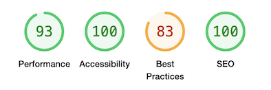

# Testing

[Return to README](README.md)

## Contents

[Manual Testing](#manual-testing) \
[Jest](#Jest)\
[User Story Validation](#user-story-validation) \
[Lighthouse Audit](#lighthouse-audit) \
[Validator Testing](#validator-testing)\
[Bugs](#bugs)

## Manual Testing

**Device and Browser Testing**

|**Testing** |**iPhone12 safari** |**iPad Pro 9.7" safari**|**MacBook Air Chrome**|**MacBook Air Safari**|**Lenovo MS OS Edge**|**Lenovo MS OS Edge**|**Chrome Developer Tools**|
|-----|-----|-----|-----|-----|-----|-----|-----|
|Responsive| Yes| Yes|Yes|Yes|Yes|Yes|Yes|
|Contact form opens in a new window| Yes| Yes|Yes|Yes|Yes|Yes|Yes|
|Contact form won't submit without appropriate information| Yes | Yes|Yes|Yes|Yes|Yes|Yes|
|Alert appears when form is submitted|Yes|Yes|Yes|Yes|Yes|Yes|Yes|
|Keyboard is playable on Hangman|Yes| Yes|Yes|Yes|Yes|Yes|Under 320px the buttons begin to move lines. I made the decision not to adjust the size of the buttons to ensure the game remains playable|
|Hangman blank letters are visible as the game is played|Yes|Yes|Yes|Yes|Yes| Yes|Screens under 250px wide the game becomes unplayable - added media query to alert user in this scenario|

|**Additional Devices Tested Using Chrome Developer Tools**|**Responsive Observations**
|-----|-----|
|Galaxy S9+|P button on hangman game moves to a new line (under 320px)|
|Galaxy S20 Ultra|P button on hangman game moves to a new line(under320px)|
|Pixel 5|
|iPad Air|
|iPad Mini|
|Surface Pro 7|
|Responsive widths to assess breakpoint issues|

**Manual Testing of User Actions**

|**Feature**     |**Action**     |**Expected Behaviour**     |**Result**     |
|----------------|---------------|---------------------------|---------------|
|Nav Bar|Click Choose Game|Navigates to index.html|Pass|
|Footer - hangman game|Hover over Help on desktop device|Displays Help information|Pass|
|Footer - hangman game|Stop hovering over Help on desktop device|Stops displaying Help information|Pass|
|Footer - hangman game|Click on Help on mobile device|Displays Help information for 10 seconds|Pass|
|Footer - maths game|Hover over Help on desktop device|Displays Help information|Pass|
|Footer - maths game|Stop hovering over Help on desktop device|Stops displaying Help information|Pass|
|Footer - maths game|click on Help on mobile device|Displays Help information for 10 seconds|Pass|
|Footer|Click contact us|Opens contact.html in a new window|Pass|
|Game Play buttons|Click Play Hangman|Opens hangman game in the same window|Pass|
|Game Play buttons|Click Play Adds & Equals|Opens Adds & Equals game in the same window|Pass|
|Hangman Game|Click Hint|Hint Displays|Pass|
|Hangman Game|Click Hint when hint is displayed|The hint disappears|Pass|
|Hangman Game|Click New Game|The game resets, a new word is chosen and the hint is hidden when displayed|Pass|
|Hangman Game|Click letter button|button greys out, if letter is correct then letter is displayed, if letter is incorrect then hangman game advances one wrong move|Pass|
|Adds & Equals Game|Click New Question|New maths question is displayed|Pass|
|Adds & Equals Game|Click Submit Answer|The answer is submitted, win or loss screen displays|Pass|
|Adds & Equals Game|Press Enter to submit the answer|The answer is submitted, win or loss screen displays|Pass|
|Adds & Equals Game|Press Enter without providing an answer|nothing happens|Pass|
|Adds & Equals Game|Click Reset Game|The win/loss counters are reset to zero and a new question is displayed|Pass|
|Contact Us Page|Click Send without providing Name details |Pop up: Please Fill in this Field |Pass|
|Contact Us Page|Click Send without providing Email details |Pop up: Please Fill in this Field |Pass|
|Contact Us Page|Click Send with non email text in email field|Pop up: Please include an '@' in the email address |Pass|
|Contact Us Page|Click Send without toggling a contact radio button |Pop up: Please select one of these options |Pass|
|Contact Us Page|Click Send without filling in 'whats on your mind'|Pop up: Please Fill in this Field |Pass|
|Contact Us Page|Click Send without selecting what the feedback is in relation to|As this is not essential, form submits and alert appears: Your email has been sent - thank you have a great day!|Pass|
|Contact Us Page|Click Send with all fields provided |form submits and alert appears: Your email has been sent - thank you have a great day!|Pass|
|Win Screen - Hangman|Click Play Again|Win screen disappears and a new Hangman game is displayed|Pass|
|Loss Screen - Hangman|Click Play Again|Loss screen disappears and a new Hangman game is displayed|Pass|
|Win Screen - Adds & Equals|Click Play Again|Win screen disappears and a new Adds & Equals game is displayed|Pass|
|Loss Screen - Adds & Equals|Click Play Again|Loss screen disappears and a new Adds & Equals game is displayed|Pass|

## Jest

I considered using jest to test my project but in the end decided that I would manually test on this occasion and practice using jest on another project using a strictly test driven development approach and red, green, refactor. On this project I kept jumping to the code I believed was the solution and I felt I needed to slow down and practice with Jest before using for a milestone/time sensitive project. 

## User Story Validation

|**User Story**|**Outcome**|**Screengrabs**|
|-----|-----|-----|
|**_FIRST TIME User_**|
|Intuitively and easily navigate the site|The layout of the site is simple and easy to navigate|[Choose Game](assets/images/testing/nav-other.png) [Game Play Buttons](assets/images/testing/game-play.png)|
|Intuitively be able to play the game/games|Game play is intuitive and easily grasped, all buttons are descriptive of their function|[Hangman Gameplay](assets/images/testing/hangman.png) / [Adds & Equals Gameplay](assets/images/testing/maths.png)
|Find help or instruction if necessary|Simple reassuring instructions are available in the games. For more complex issues the user can utilise the contact us feature.|[Hangman Help](assets/images/testing/help-hangman.png) / [Adds & Equals Help](assets/images/testing/help-maths.png)
|Play the games on a mobile device without the need for any additional downloads.|Games can be played on any device with a screen width greater than 250px straight from the browser|
|**_RETURNING user_**|
|Easily navigate to my favourite game|Games are easily accessed from the homepage|[Game Play Buttons](assets/images/testing/game-play.png)|
|Send feedback and ideas for more games to the website owner|The user can send a contact email using the contact us form|[Contact Form](assets/images/testing/contact.png)|

## Lighthouse Audit

When I initially ran the lighthouse audit there were two issues that I deemed significant but resolvable issues
1. Meta description. While this isn't really necessary for this project I felt it would be best practice to add. 
2. No label for the input box on the Maths game for accessibility purposes. 

When I ran a final lighthouse audit prior to submission there was a best practice error originating from the minified jQuery mobile code.

Some additional improvements to performance could be made, reducing the image size and number of scripts to improve the load time.
   
## Compliant Code

[W3C HTML validator](https://validator.w3.org/)

All pages of HTML pass through the validator without any issues.

[CSS validator Jigsaw](https://jigsaw.w3.org/css-validator/)

No errors were returned when the css was passed through the validator by direct input.

[JavaScript linter](https://www.jslint.com/)

I used JSLint to validate my Javascript, initially the level of warnings returned was very high mainly concerned with the use of single quotes instead of double quotes and alphabetical order in objects. On reviewing the functionality I discovered that I could 'allow' parameters to the check. This then reduced the warnings to a reviewable level. I had instances of additional semi colons in the code which I removed and I had incorrectly used continue in a for loop. jsLint continues to show high levels of warnings such as document undeclared and $ undeclared. I concluded that the remaining errors should not be considered due to them referring to the DOM and/or other libraries or scripts. I reviewed the warnings with my Mentor who was in agreement with my conclusion with one exception I have missed a let in a loop, which I corrected. 

[JSHint](jshint.com)

Prior to submitting, while completing the checklist for myself an additional validator which I passed my JS thorugh to be careful. I was satifised and reassured by the results. 

## Bugs

|**Bug**|**Resolution**|
|-----|-----|
|sendMail|I encountered a bug, truthfully I made an error when setting up the sendMail function. I now cannot remember what it was or how I fixed it so the lesson I have learnt is to improve the notes I write to myself on bugs I encounter during the development process. I added the alert to the user as part of the fix.|
|Correctly guessed letters not displaying in the correct position|I had forgotten to include the li items used in the Nav when I calculated the code for displayGuessedLetters|
|Unused page called mole.html displaying on every button press|I missed a closing angle bracket on a holding nav item|
|Hangman game whilst responsive to the screen size was unplayable due to the small buttons and word display| refactored the code to ensure word and the buttons displayed correctly on small screens and remained playable|
|Maths game submitting empty field|As I had an autofocus on the input field the maths game was submitting empty fields when the win or loss screens were displayed. I tried adding a required field to the input which didn’t work. To solve the problem I amended the event listener to not run check answer when the field was empty|

[Return to README](README.md)